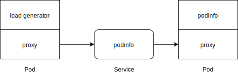
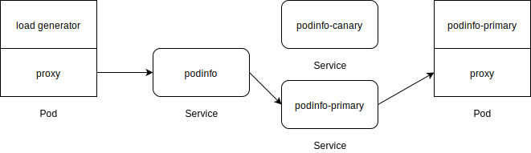
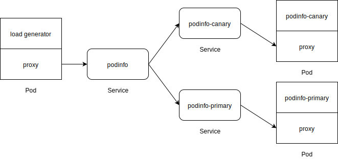

# Progressive delivery on Azure Kubernetes services

Flagger was designed to give developers confidence in automating production releases with progressive delivery techniques. This repository contains a demo application that is backed by the Azure Pipelines and demonstrates how Canary releases can be configured for services with Flagger and Linkerd running on Azure Kubernetes service. 

## How to deploy

The application is an asp.net application on .net core 5. It has bash scripts for building and deploying the artifacts on AKS. The deploy script also installs flagger on Azure Kubernetes service. There is a Azure Pipeline that creates the AKS and installs linkerd that is not part of this repository.

## How to monitor the canary releases visually

Either using ```K9S``` or using the **KubeView**. I am mostlying using KubeView to see the flagger generated __canary__ deployment and pods visually by running it locally on docker:

```
docker run --rm -d -p 8080:8000 -v  C:\Users\mohossa\.kube:/.kube/ ghcr.io/benc-uk/kubeview:0.1.17
```

## Understanding the demo
After lunching the demo the topology would look like below:



Next, we create the CRD for Flagger - that is the [canary definition](.src/manifests/bocanary-canary.yml).

Right after the CRD exists, our topology will turn into following:




At that point we can make a change the asp.net app and redeploy the pipeline - which will update the image tag and we will observe the topology changed to following: 



After certain time, when linkerd traffic splits detects no failure on canary releases it will swap out the primary with canary and the canary will be removed.

That's all.
